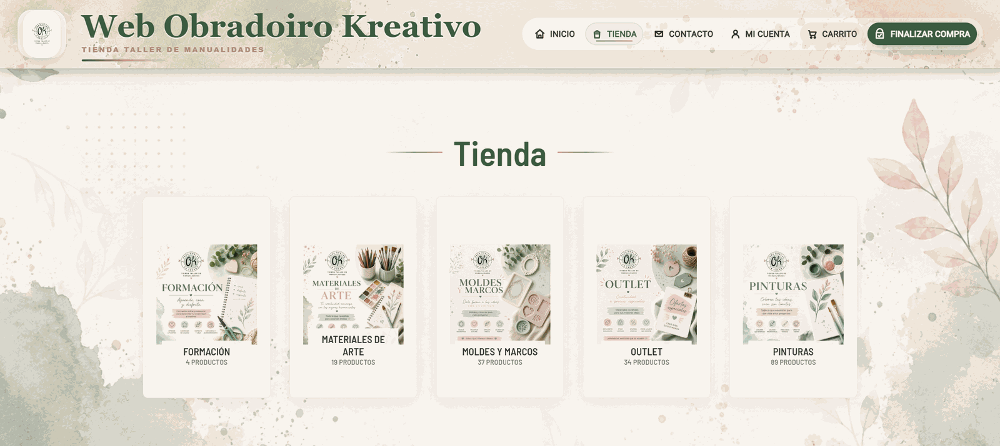
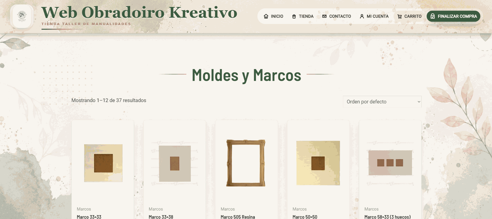
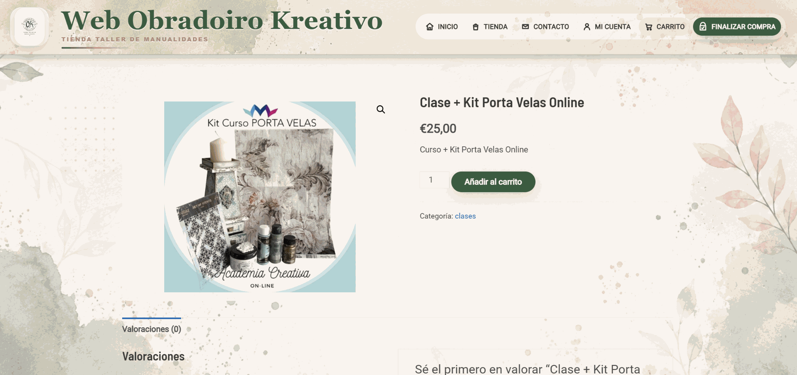
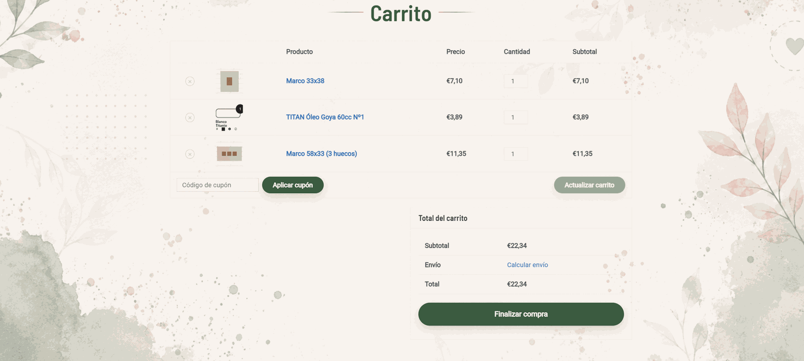
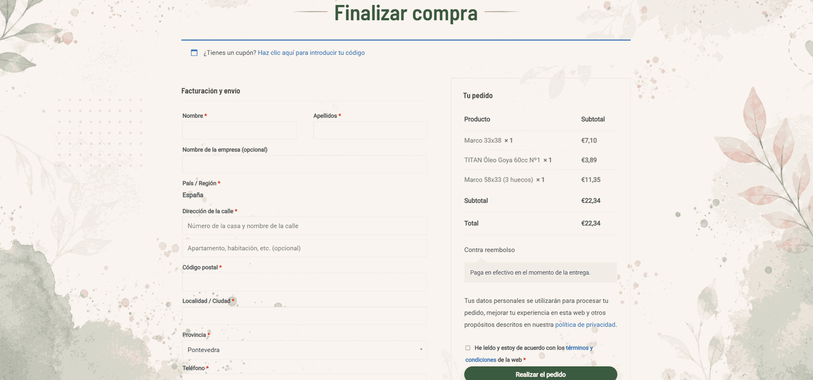
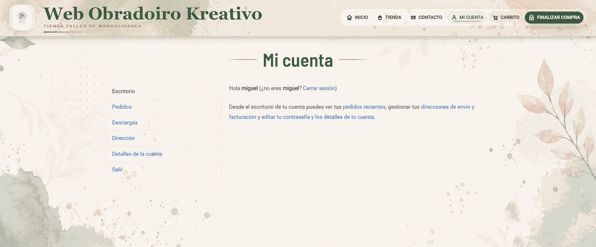
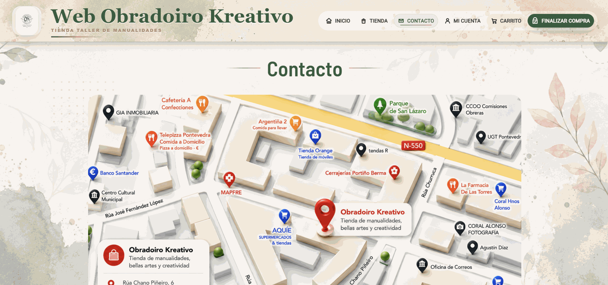
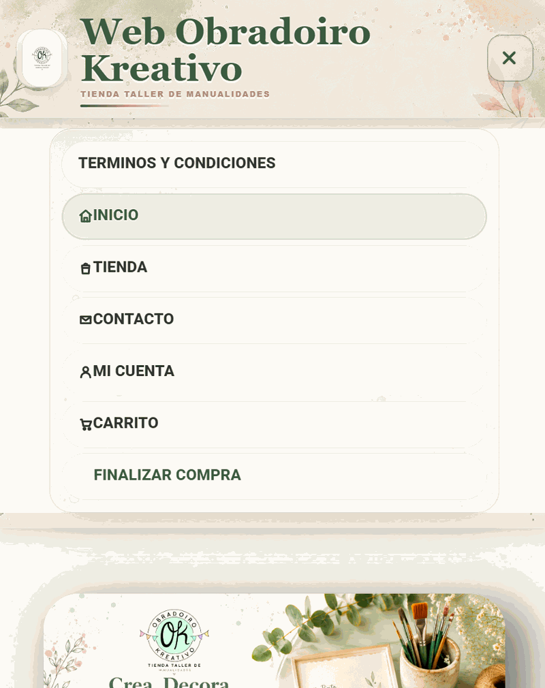

# Obradoiro Kreativo - Personalizacion WordPress/WooCommerce

Proyecto de personalizacion visual y funcional de una tienda online creada con WordPress y WooCommerce para una marca de manualidades, creatividad y formacion artesanal.

El objetivo del proyecto fue transformar una instalacion WordPress en una tienda con identidad propia, cuidando la experiencia visual, el responsive, la navegacion, el catalogo de productos, el carrito y el proceso de compra.

## Vista general


## Que incluye este repositorio

Este repositorio no contiene una instalacion completa de WordPress. Esta preparado como portfolio tecnico para mostrar el trabajo realizado de forma clara y segura.

Incluye:

- CSS personalizado usado en WordPress.
- Fragmentos JavaScript para mejorar la interfaz.
- Fragmentos PHP para personalizar WooCommerce.
- Capturas optimizadas del resultado final.
- Documentacion de plugins utilizados.
- Explicacion de decisiones tecnicas.

No incluye:

- Credenciales.
- Base de datos.
- Archivos privados de WordPress.
- Plugins completos.
- Configuraciones SMTP o claves API.
- Datos reales de clientes o pedidos.

## Tecnologias utilizadas

- WordPress.
- WooCommerce.
- Astra.
- Elementor.
- WPCode Lite.
- CSS personalizado.
- JavaScript personalizado.
- PHP snippets para WooCommerce.

## Partes principales del trabajo

### Diseno visual

Se creo una identidad visual coherente para la tienda, usando una paleta basada en verdes, tonos crema y acentos rosados. El fondo floral, las tarjetas, la cabecera y el footer se ajustaron para crear una experiencia mas artesanal y cuidada.

### Header y menu

El header fue personalizado para que funcionara como elemento principal de marca:

- Logo tratado como insignia visual.
- Titulo principal con estilo editorial.
- Subtitulo de marca.
- Menu con iconos SVG.
- Botones destacados para carrito y finalizar compra.
- Menu responsive adaptado a movil.

### WooCommerce

WooCommerce fue adaptado visualmente para integrarse con la marca:

- Tarjetas de productos alineadas.
- Imagenes de productos normalizadas.
- Categorias visuales.
- Botones personalizados.
- Paginacion con estilo propio.
- Ajustes para carrito, checkout y cuenta de usuario.

### JavaScript

Se usaron fragmentos JS para mejorar la interaccion:

- Animacion de titulos letra a letra.
- Insercion dinamica de iconos en el menu.
- Efecto de brillo suave al pasar el puntero por el menu.

### PHP

Se uso un fragmento PHP con hooks de WooCommerce para anadir un boton personalizado de "Volver a la Tienda" al final de las categorias de producto.

## Capturas

### Inicio


### Categorias de producto



### Subseccion



### Producto individual



### Carrito



### Checkout



### Mi cuenta



### Contacto



### Responsive tablet


### Responsive movil


### Menu movil



## Estructura del repositorio

```text
Obradoiro-Kreativo-GitHub/
├─ README.md
├─ .gitignore
├─ code/
│  ├─ css/
│  │  └─ obradoiro-kreativo.css
│  ├─ js/
│  │  ├─ menu-icons-effects.js
│  │  └─ page-title-animation.js
│  └─ php/
│     └─ woocommerce-back-to-shop-button.php
├─ docs/
│  ├─ css-organizacion-notas.md
│  ├─ decisiones-tecnicas.md
│  ├─ estructura-repositorio.md
│  ├─ plugins-utilizados.md
│  └─ seguridad-y-privacidad.md
└─ screenshots/
   ├─ carrito.png
   ├─ categoria-productos.png
   ├─ checkout.png
   ├─ contacto.png
   ├─ inicio.png
   ├─ producto.png
   ├─ responsive-phone.png
   ├─ responsive-phone-menu.png
   ├─ responsive-tablet.png
   ├─ users.png
   └─ subseccion.png

```

## Documentacion

- [Plugins utilizados](docs/plugins-utilizados.md)
- [Decisiones tecnicas](docs/decisiones-tecnicas.md)
- [Estructura del repositorio](docs/estructura-repositorio.md)
- [Seguridad y privacidad](docs/seguridad-y-privacidad.md)
- [Notas de organizacion del CSS](docs/css-organizacion-notas.md)
- [Fragmentos de codigo](code/README-code-snippets.md)

## Nota sobre el proyecto

Este repositorio esta enfocado a mostrar el trabajo de personalizacion realizado sobre WordPress y WooCommerce. No pretende ser una aplicacion instalable desde cero, sino una muestra tecnica del proceso de adaptacion visual, funcional y responsive de una tienda online real.
